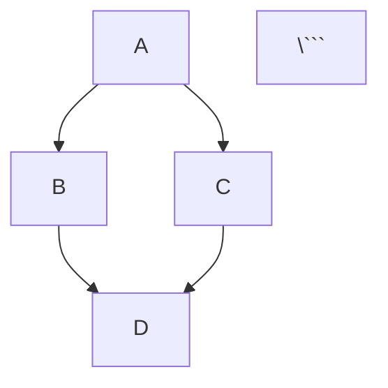

# ⚙️ Configuration Changes

> **Documento di Riferimento**: Tutte le modifiche necessarie ai file di configurazione Docusaurus
> **Last Updated**: 2025-10-06

:::warning ⚠️ AGGIORNAMENTO 2025-10-06
**Sezione "Informazioni Generali" RIMOSSA** dal progetto.

**Motivazione**: Ridondanza 95%+ con contenuti già coperti in `docs/index.md`, `docs/giorno-1-foundations/index.md`, e `docs/risorse/faq.md`.

Tutte le configurazioni footer e sidebar in questo documento che menzionano "Informazioni Generali" sono da **IGNORARE/RIMUOVERE**.
:::

---

## 📋 Overview Modifiche

Questo documento elenca tutte le modifiche da apportare ai file di configurazione per trasformare il sito demo in workshop LLM.

**File da modificare**:
1. `docusaurus.config.ts` - Configurazione principale
2. `sidebars.ts` - Struttura navigazione
3. `src/pages/index.tsx` - Homepage (opzionale: personalizzazione avanzata)
4. `package.json` - Eventuali plugin aggiuntivi
5. `.gitignore` - Aggiungere .workshop-state.json

---

## 1️⃣ docusaurus.config.ts

### Modifiche da Applicare

#### A) Metadata del Sito

**CURRENT**:
```typescript
const config: Config = {
  title: 'LLM from Zero to Hero',
  tagline: 'Learn about Large Language Models',
  favicon: 'img/favicon.ico',
```

**CHANGE TO**:
```typescript
const config: Config = {
  title: 'Workshop LLM: From Casual User to Power User',
  tagline: 'Corso intensivo per profili non-tecnici: padroneggia Claude e gli LLM nel lavoro quotidiano',
  favicon: 'img/favicon.ico', // TODO: Sostituire con favicon custom se disponibile
```

---

#### B) Locale (Opzionale - se vuoi Italiano)

**CURRENT**:
```typescript
i18n: {
  defaultLocale: 'en',
  locales: ['en'],
},
```

**OPTIONAL CHANGE** (se vuoi interfaccia in italiano):
```typescript
i18n: {
  defaultLocale: 'it',
  locales: ['it'],
  // Se multilingua futuro:
  // locales: ['it', 'en'],
},
```

**NOTA**: Il contenuto dei docs sarà in italiano comunque. Questa config cambia solo UI labels di Docusaurus (es: "Next", "Previous" → "Avanti", "Indietro")

---

#### C) Navbar Configuration

**CURRENT**:
```typescript
navbar: {
  title: 'LLM from Zero to Hero',
  logo: {
    alt: 'LLM Logo',
    src: 'img/logo.svg',
  },
  items: [
    {
      type: 'docSidebar',
      sidebarId: 'tutorialSidebar',
      position: 'left',
      label: 'Tutorial',
    },
    {to: '/blog', label: 'Blog', position: 'left'},
    {
      href: 'https://github.com/andreadicagno/LLM-from-zero-to-hero',
      label: 'GitHub',
      position: 'right',
    },
  ],
},
```

**CHANGE TO**:
```typescript
navbar: {
  title: 'Workshop LLM',
  logo: {
    alt: 'Workshop LLM Logo',
    src: 'img/logo.svg', // TODO: Logo custom se disponibile
  },
  items: [
    {
      type: 'docSidebar',
      sidebarId: 'mainSidebar',
      position: 'left',
      label: '📚 Corso',
    },
    {
      type: 'dropdown',
      label: '📅 Giorni',
      position: 'left',
      items: [
        {
          label: 'Giorno 1: Foundations',
          to: '/docs/giorno-1-foundations',
        },
        {
          label: 'Giorno 2: Claude Features',
          to: '/docs/giorno-2-claude-features',
        },
        {
          label: 'Giorno 3: Claude Code',
          to: '/docs/giorno-3-claude-code',
        },
      ],
    },
    {
      to: '/docs/risorse',
      label: '🔧 Risorse',
      position: 'left',
    },
    // Opzionale: mantieni blog come "Annunci"
    // {to: '/blog', label: '📣 Annunci', position: 'left'},
    {
      href: 'https://github.com/andreadicagno/LLM-from-zero-to-hero',
      label: 'GitHub',
      position: 'right',
    },
  ],
},
```

**Note**:
- Cambiato `tutorialSidebar` → `mainSidebar` (da aggiornare anche in sidebars.ts)
- Aggiunto dropdown per accesso rapido ai 3 giorni
- Link diretto a Risorse
- Blog opzionale (può essere rimosso o rinominato "Annunci")

---

#### D) Footer Configuration

**CURRENT**:
```typescript
footer: {
  style: 'dark',
  links: [
    {
      title: 'Docs',
      items: [
        {
          label: 'Tutorial',
          to: '/docs/intro',
        },
      ],
    },
    {
      title: 'More',
      items: [
        {
          label: 'Blog',
          to: '/blog',
        },
        {
          label: 'GitHub',
          href: 'https://github.com/andreadicagno/LLM-from-zero-to-hero',
        },
      ],
    },
  ],
  copyright: `Copyright © ${new Date().getFullYear()} LLM from Zero to Hero. Built with Docusaurus.`,
},
```

**CHANGE TO**:
```typescript
footer: {
  style: 'dark',
  links: [
    {
      title: 'Corso',
      items: [
        {
          label: 'Home',
          to: '/docs',
        },
        {
          label: 'Informazioni Generali',
          to: '/docs/informazioni-generali',
        },
        {
          label: 'Risorse',
          to: '/docs/risorse',
        },
      ],
    },
    {
      title: 'Giorni del Workshop',
      items: [
        {
          label: 'Giorno 1: Foundations',
          to: '/docs/giorno-1-foundations',
        },
        {
          label: 'Giorno 2: Claude Features',
          to: '/docs/giorno-2-claude-features',
        },
        {
          label: 'Giorno 3: Claude Code',
          to: '/docs/giorno-3-claude-code',
        },
      ],
    },
    {
      title: 'Collegamenti',
      items: [
        {
          label: 'GitHub Repository',
          href: 'https://github.com/andreadicagno/LLM-from-zero-to-hero',
        },
        {
          label: 'Claude.ai',
          href: 'https://claude.ai',
        },
        {
          label: 'Anthropic Docs',
          href: 'https://docs.anthropic.com/',
        },
      ],
    },
  ],
  copyright: `Copyright © ${new Date().getFullYear()} Workshop LLM. Materiali didattici per uso educativo. Built with Docusaurus.`,
},
```

---

#### E) Theme Configuration (Opzionale - Personalizzazione Colori)

**CURRENT** (default):
```typescript
prism: {
  theme: prismThemes.github,
  darkTheme: prismThemes.dracula,
},
```

**OPTIONAL - Custom Colors** (da aggiungere in themeConfig):
```typescript
themeConfig: {
  // ... existing config

  colorMode: {
    defaultMode: 'light',
    disableSwitch: false,
    respectPrefersColorScheme: true,
  },

  // Custom theme colors (opzionale)
  // Uncomment e modifica per personalizzare brand colors
  /*
  colors: {
    primaryColor: '#7C3AED', // Purple - LLM theme
    secondaryColor: '#EC4899', // Pink accent
  },
  */
} satisfies Preset.ThemeConfig,
```

---

#### F) Docs Configuration

**CURRENT**:
```typescript
docs: {
  sidebarPath: './sidebars.ts',
  editUrl: 'https://github.com/andreadicagno/LLM-from-zero-to-hero/tree/main/',
},
```

**OPTIONAL ENHANCEMENTS**:
```typescript
docs: {
  sidebarPath: './sidebars.ts',

  // Edit link - opzionale: mantieni o rimuovi
  editUrl: 'https://github.com/andreadicagno/LLM-from-zero-to-hero/tree/main/',

  // Breadcrumbs - utile per navigation
  breadcrumbs: true,

  // Show last update date
  showLastUpdateTime: true,
  showLastUpdateAuthor: false, // true se multi-author

  // Sidebar collapsible categories
  sidebarCollapsible: true,
  sidebarCollapsed: true, // Default collapsed
},
```

---

#### G) Blog Configuration (Opzionale)

**OPTION 1: Mantieni come "Annunci"**:
```typescript
blog: {
  blogTitle: 'Annunci e Aggiornamenti',
  blogDescription: 'News e aggiornamenti del workshop',
  postsPerPage: 'ALL',
  showReadingTime: true,
  blogSidebarTitle: 'Tutti gli annunci',
  blogSidebarCount: 'ALL',
},
```

**OPTION 2: Disabilita Blog**:
```typescript
// Commenta o rimuovi sezione blog dal preset
blog: false,
```

Se disabiliti, rimuovi anche link blog da navbar e footer.

---

### Full docusaurus.config.ts (Final Version)

```typescript
import {themes as prismThemes} from 'prism-react-renderer';
import type {Config} from '@docusaurus/types';
import type * as Preset from '@docusaurus/preset-classic';

const config: Config = {
  title: 'Workshop LLM: From Casual User to Power User',
  tagline: 'Corso intensivo per profili non-tecnici: padroneggia Claude e gli LLM nel lavoro quotidiano',
  favicon: 'img/favicon.ico',

  future: {
    v4: true,
  },

  url: 'https://andreadicagno.github.io',
  baseUrl: '/LLM-from-zero-to-hero/',

  organizationName: 'andreadicagno',
  projectName: 'LLM-from-zero-to-hero',
  deploymentBranch: 'gh-pages',

  onBrokenLinks: 'throw',

  i18n: {
    defaultLocale: 'it',
    locales: ['it'],
  },

  presets: [
    [
      'classic',
      {
        docs: {
          sidebarPath: './sidebars.ts',
          editUrl: 'https://github.com/andreadicagno/LLM-from-zero-to-hero/tree/main/',
          breadcrumbs: true,
          showLastUpdateTime: true,
          sidebarCollapsible: true,
          sidebarCollapsed: true,
        },
        blog: {
          blogTitle: 'Annunci e Aggiornamenti',
          blogDescription: 'News e aggiornamenti del workshop',
          showReadingTime: true,
          postsPerPage: 'ALL',
          blogSidebarTitle: 'Tutti gli annunci',
          blogSidebarCount: 'ALL',
        },
        theme: {
          customCss: './src/css/custom.css',
        },
      } satisfies Preset.Options,
    ],
  ],

  themeConfig: {
    image: 'img/docusaurus-social-card.jpg',

    colorMode: {
      defaultMode: 'light',
      disableSwitch: false,
      respectPrefersColorScheme: true,
    },

    navbar: {
      title: 'Workshop LLM',
      logo: {
        alt: 'Workshop LLM Logo',
        src: 'img/logo.svg',
      },
      items: [
        {
          type: 'docSidebar',
          sidebarId: 'mainSidebar',
          position: 'left',
          label: '📚 Corso',
        },
        {
          type: 'dropdown',
          label: '📅 Giorni',
          position: 'left',
          items: [
            {
              label: 'Giorno 1: Foundations',
              to: '/docs/giorno-1-foundations',
            },
            {
              label: 'Giorno 2: Claude Features',
              to: '/docs/giorno-2-claude-features',
            },
            {
              label: 'Giorno 3: Claude Code',
              to: '/docs/giorno-3-claude-code',
            },
          ],
        },
        {
          to: '/docs/risorse',
          label: '🔧 Risorse',
          position: 'left',
        },
        {to: '/blog', label: '📣 Annunci', position: 'left'},
        {
          href: 'https://github.com/andreadicagno/LLM-from-zero-to-hero',
          label: 'GitHub',
          position: 'right',
        },
      ],
    },

    footer: {
      style: 'dark',
      links: [
        {
          title: 'Corso',
          items: [
            {
              label: 'Home',
              to: '/docs',
            },
            {
              label: 'Informazioni Generali',
              to: '/docs/informazioni-generali',
            },
            {
              label: 'Risorse',
              to: '/docs/risorse',
            },
          ],
        },
        {
          title: 'Giorni del Workshop',
          items: [
            {
              label: 'Giorno 1: Foundations',
              to: '/docs/giorno-1-foundations',
            },
            {
              label: 'Giorno 2: Claude Features',
              to: '/docs/giorno-2-claude-features',
            },
            {
              label: 'Giorno 3: Claude Code',
              to: '/docs/giorno-3-claude-code',
            },
          ],
        },
        {
          title: 'Collegamenti',
          items: [
            {
              label: 'GitHub Repository',
              href: 'https://github.com/andreadicagno/LLM-from-zero-to-hero',
            },
            {
              label: 'Claude.ai',
              href: 'https://claude.ai',
            },
            {
              label: 'Anthropic Docs',
              href: 'https://docs.anthropic.com/',
            },
          ],
        },
      ],
      copyright: `Copyright © ${new Date().getFullYear()} Workshop LLM. Materiali didattici per uso educativo. Built with Docusaurus.`,
    },

    prism: {
      theme: prismThemes.github,
      darkTheme: prismThemes.dracula,
    },
  } satisfies Preset.ThemeConfig,
};

export default config;
```

---

## 2️⃣ sidebars.ts

### Struttura Completa Sidebar

**CURRENT** (auto-generated):
```typescript
const sidebars: SidebarsConfig = {
  tutorialSidebar: [{type: 'autogenerated', dirName: '.'}],
};
```

**CHANGE TO** (manual sidebar con struttura completa):

```typescript
import type {SidebarsConfig} from '@docusaurus/plugin-content-docs';

const sidebars: SidebarsConfig = {
  mainSidebar: [
    {
      type: 'doc',
      id: 'index',
      label: '🏠 Home',
    },

    // Informazioni Generali
    {
      type: 'category',
      label: '📋 Informazioni Generali',
      collapsed: false,
      items: [
        'informazioni-generali/index',
        'informazioni-generali/obiettivi',
        'informazioni-generali/prerequisiti',
        'informazioni-generali/metodologia',
        'informazioni-generali/risultati-attesi',
      ],
    },

    // Giorno 1
    {
      type: 'category',
      label: '📅 Giorno 1: Foundations',
      collapsed: true,
      items: [
        'giorno-1-foundations/index',
        {
          type: 'category',
          label: '01 - LLM Foundations',
          items: [
            'giorno-1-foundations/01-llm-foundations/index',
            'giorno-1-foundations/01-llm-foundations/01-token',
            'giorno-1-foundations/01-llm-foundations/02-anatomia-llm',
            'giorno-1-foundations/01-llm-foundations/03-ragionamento',
            'giorno-1-foundations/01-llm-foundations/04-contesto',
            'giorno-1-foundations/01-llm-foundations/05-multimodalita',
            'giorno-1-foundations/01-llm-foundations/06-concetti-chiave',
          ],
        },
        {
          type: 'category',
          label: '02 - Prompt Engineering',
          items: [
            'giorno-1-foundations/02-prompt-engineering-teoria/index',
            'giorno-1-foundations/02-prompt-engineering-teoria/01-anatomia-prompt',
            'giorno-1-foundations/02-prompt-engineering-teoria/02-framework-race',
            'giorno-1-foundations/02-prompt-engineering-teoria/03-chain-of-thought',
            'giorno-1-foundations/02-prompt-engineering-teoria/04-few-shot-learning',
            'giorno-1-foundations/02-prompt-engineering-teoria/05-role-based',
            'giorno-1-foundations/02-prompt-engineering-teoria/06-meta-prompting',
            'giorno-1-foundations/02-prompt-engineering-teoria/07-debugging',
          ],
        },
        {
          type: 'category',
          label: '03 - Esercizi Pratici',
          items: [
            'giorno-1-foundations/03-esercizi-pratici/index',
            'giorno-1-foundations/03-esercizi-pratici/esercizio-1-ottimizzazione',
            'giorno-1-foundations/03-esercizi-pratici/esercizio-2-template',
          ],
        },
      ],
    },

    // Giorno 2
    {
      type: 'category',
      label: '📅 Giorno 2: Claude Features',
      collapsed: true,
      items: [
        'giorno-2-claude-features/index',
        {
          type: 'category',
          label: '01 - Projects & Output Styles',
          items: [
            'giorno-2-claude-features/01-projects-output-styles/index',
            'giorno-2-claude-features/01-projects-output-styles/01-claude-projects',
            'giorno-2-claude-features/01-projects-output-styles/02-custom-instructions',
            'giorno-2-claude-features/01-projects-output-styles/03-knowledge-base',
            'giorno-2-claude-features/01-projects-output-styles/04-output-styles',
            'giorno-2-claude-features/01-projects-output-styles/05-tools-mcp',
            'giorno-2-claude-features/01-projects-output-styles/06-pratica-integrata',
          ],
        },
        {
          type: 'category',
          label: '02 - Artifacts & Search',
          items: [
            'giorno-2-claude-features/02-artifacts-search/index',
            'giorno-2-claude-features/02-artifacts-search/01-artifacts',
            'giorno-2-claude-features/02-artifacts-search/02-deep-research',
            'giorno-2-claude-features/02-artifacts-search/03-file-processing',
            'giorno-2-claude-features/02-artifacts-search/04-challenge-finale',
          ],
        },
      ],
    },

    // Giorno 3
    {
      type: 'category',
      label: '📅 Giorno 3: Claude Code',
      collapsed: true,
      items: [
        'giorno-3-claude-code/index',
        {
          type: 'category',
          label: '01 - Introduzione',
          items: [
            'giorno-3-claude-code/01-introduzione/index',
            'giorno-3-claude-code/01-introduzione/01-overview',
            'giorno-3-claude-code/01-introduzione/02-capabilities-non-dev',
            'giorno-3-claude-code/01-introduzione/03-setup',
          ],
        },
        {
          type: 'category',
          label: '02 - Documentation',
          items: [
            'giorno-3-claude-code/02-documentation/index',
            'giorno-3-claude-code/02-documentation/01-creare-documentazione',
            'giorno-3-claude-code/02-documentation/02-standardizzare',
            'giorno-3-claude-code/02-documentation/03-knowledge-base',
            'giorno-3-claude-code/02-documentation/04-workshop-pratico',
          ],
        },
        {
          type: 'category',
          label: '03 - Research & Analysis',
          items: [
            'giorno-3-claude-code/03-research-analysis/index',
            'giorno-3-claude-code/03-research-analysis/01-analisi-repository',
            'giorno-3-claude-code/03-research-analysis/02-estrazione-insights',
            'giorno-3-claude-code/03-research-analysis/03-synthesis',
          ],
        },
        {
          type: 'category',
          label: '04 - Progetto Finale',
          items: [
            'giorno-3-claude-code/04-progetto-finale/index',
            'giorno-3-claude-code/04-progetto-finale/01-brief',
            'giorno-3-claude-code/04-progetto-finale/02-presentazioni',
            'giorno-3-claude-code/04-progetto-finale/03-wrap-up',
          ],
        },
      ],
    },

    // Risorse
    {
      type: 'category',
      label: '📚 Risorse',
      collapsed: true,
      items: [
        'risorse/index',
        'risorse/template-prompt',
        'risorse/glossario',
        'risorse/link-utili',
        'risorse/faq',
      ],
    },
  ],
};

export default sidebars;
```

**Note**:
- Cambiato nome sidebar da `tutorialSidebar` a `mainSidebar` (match navbar)
- Struttura manuale per controllo completo
- Emoji per visual clarity (🏠📋📅📚)
- Giorno 1 `collapsed: false` (aperto di default), altri `true`
- Nested categories per moduli

---

## 3️⃣ package.json (Opzionale - Plugin Aggiuntivi)

### Plugin Utili da Considerare

**OPTIONAL**: Aggiungi questi plugin se vuoi features extra

#### A) Search (Algolia o Local Search)

**Opzione 1 - Algolia DocSearch** (Gratis per progetti open source):
```json
// No package install needed, just config in docusaurus.config.ts
{
  "themeConfig": {
    "algolia": {
      "appId": "YOUR_APP_ID",
      "apiKey": "YOUR_API_KEY",
      "indexName": "workshop-llm"
    }
  }
}
```

**Opzione 2 - Local Search**:
```bash
npm install --save @easyops-cn/docusaurus-search-local
```

Then in docusaurus.config.ts:
```typescript
themes: [
  [
    require.resolve("@easyops-cn/docusaurus-search-local"),
    {
      hashed: true,
      language: ["it"],
      highlightSearchTermsOnTargetPage: true,
    },
  ],
],
```

#### B) Mermaid Diagrams (per diagrammi in markdown)

```bash
npm install --save @docusaurus/theme-mermaid
```

Config:
```typescript
markdown: {
  mermaid: true,
},
themes: ['@docusaurus/theme-mermaid'],
```

Usage in docs:
```markdown


#### C) Image Zoom (click per ingrandire)

```bash
npm install --save docusaurus-plugin-image-zoom
```

Config:
```typescript
plugins: [
  'docusaurus-plugin-image-zoom',
],
```

---

## 4️⃣ .gitignore

### Aggiungi File Workshop-Specific

```bash
# Aggiungi queste righe a .gitignore esistente

# Workshop state (se usi tracking progresso)
.workshop-state.json

# File temporanei esercizi partecipanti
docs/**/*_draft.md
docs/**/*_temp.md

# Note personali facilitatore
.workshop-notes/
```

---

## 5️⃣ Static Assets

### File da Aggiungere/Sostituire in `static/`

#### A) Favicon Custom (Opzionale)

Sostituisci `static/img/favicon.ico` con favicon custom workshop

#### B) Logo Custom (Opzionale)

Sostituisci `static/img/logo.svg` con logo workshop

#### C) Immagini Corso

Crea directories:
```
static/img/
├── giorno-1/       # Screenshots, diagrammi Giorno 1
├── giorno-2/       # Screenshots Claude features
├── giorno-3/       # Screenshots Claude Code
├── esercizi/       # Asset per esercizi
└── general/        # Immagini generiche
```

---

## 6️⃣ Custom CSS (Opzionale)

### Personalizzazioni in `src/css/custom.css`

**Aggiungi** (opzionale - migliora styling):

```css
/* Custom Workshop Styling */

/* Primary brand color */
:root {
  --ifm-color-primary: #7C3AED;
  --ifm-color-primary-dark: #6D28D9;
  --ifm-color-primary-darker: #5B21B6;
  --ifm-color-primary-darkest: #4C1D95;
  --ifm-color-primary-light: #8B5CF6;
  --ifm-color-primary-lighter: #A78BFA;
  --ifm-color-primary-lightest: #C4B5FD;
}

/* Dark mode colors */
[data-theme='dark'] {
  --ifm-color-primary: #A78BFA;
  --ifm-color-primary-dark: #8B5CF6;
  /* ... altri colori dark mode */
}

/* Emoji in headings - better spacing */
h1 .emoji,
h2 .emoji,
h3 .emoji {
  margin-right: 0.3em;
}

/* Admonitions custom colors per learning objectives */
.admonition-learning-objectives {
  border-left-color: var(--ifm-color-primary);
}

/* Code blocks - highlight important lines */
.docusaurus-highlight-code-line {
  background-color: rgba(124, 58, 237, 0.1);
  display: block;
  margin: 0 calc(-1 * var(--ifm-pre-padding));
  padding: 0 var(--ifm-pre-padding);
}

/* Exercise boxes */
.exercise-box {
  background: var(--ifm-color-primary-lightest);
  border-left: 4px solid var(--ifm-color-primary);
  padding: 1rem;
  margin: 1rem 0;
  border-radius: 4px;
}

/* Key takeaways box */
.key-takeaways {
  background: #FEF3C7;
  border-left: 4px solid #F59E0B;
  padding: 1rem;
  margin: 1rem 0;
  border-radius: 4px;
}

[data-theme='dark'] .key-takeaways {
  background: rgba(245, 158, 11, 0.1);
}
```

---

## 7️⃣ Homepage Custom (Avanzato - Opzionale)

### Modifica `src/pages/index.tsx` per Homepage Personalizzata

Se vuoi homepage molto custom oltre ai docs, modifica questo file.

**Opzioni**:
1. **Semplice**: Reindirizza automaticamente a `/docs`
2. **Intermedia**: Hero section + cards 3 giorni
3. **Avanzata**: Landing page completa con features, stats, CTA

**Opzione 1 - Auto-redirect** (più semplice):
```tsx
import {Redirect} from '@docusaurus/router';

export default function Home() {
  return <Redirect to="/docs" />;
}
```

**Opzione 2 - Hero + Cards** (template base fornito in `.workshop-plan/templates/`)

---

## 📋 Checklist Applicazione Modifiche

### Step-by-Step

- [ ] **Step 1**: Backup file originali
  ```bash
  cp docusaurus.config.ts docusaurus.config.ts.backup
  cp sidebars.ts sidebars.ts.backup
  ```

- [ ] **Step 2**: Applica modifiche a `docusaurus.config.ts`
  - [ ] Metadata (title, tagline)
  - [ ] Navbar
  - [ ] Footer
  - [ ] Docs config (breadcrumbs, etc.)
  - [ ] Blog config (o disable)

- [ ] **Step 3**: Sostituisci `sidebars.ts` con struttura manuale completa

- [ ] **Step 4**: (Opzionale) Installa plugin aggiuntivi
  - [ ] Search plugin
  - [ ] Mermaid (se usi diagrammi)
  - [ ] Image zoom

- [ ] **Step 5**: Aggiorna `.gitignore`

- [ ] **Step 6**: (Opzionale) Custom CSS per styling

- [ ] **Step 7**: (Opzionale) Homepage personalizzata

- [ ] **Step 8**: Test build
  ```bash
  npm run build
  ```

- [ ] **Step 9**: Test local server
  ```bash
  npm run start
  ```

- [ ] **Step 10**: Fix eventuali broken links

---

## 🚨 Troubleshooting

### Errori Comuni

**Errore: "Sidebar item not found"**
- Verifica che path in `sidebars.ts` corrispondano a file esistenti
- Path relativo a `docs/`, no `.md` extension

**Errore: "Cannot find module"**
- Se hai installato plugin, run `npm install`
- Clear cache: `npm run clear`

**Build fallisce**
- Check broken links: `npm run build` mostra errori
- Verifica frontmatter in tutti i docs

**Navbar dropdown non funziona**
- Verifica syntax object dropdown in config
- Check che path `/docs/giorno-X` esistano

---

## 🎯 Priorità Modifiche

### Must Have (Fase 1)
1. ✅ docusaurus.config.ts - metadata base (title, tagline)
2. ✅ sidebars.ts - struttura completa manuale
3. ✅ Navbar - link ai 3 giorni
4. ✅ Footer - link utili

### Nice to Have (Fase 2)
5. ⭐ Custom CSS - styling migliorato
6. ⭐ Plugin search (local o Algolia)
7. ⭐ Homepage personalizzata

### Optional (Fase 3)
8. 💡 Mermaid diagrams
9. 💡 Image zoom
10. 💡 Localizzazione IT completa

---

**🎯 Applica queste modifiche dopo aver creato la struttura docs/ completa**
