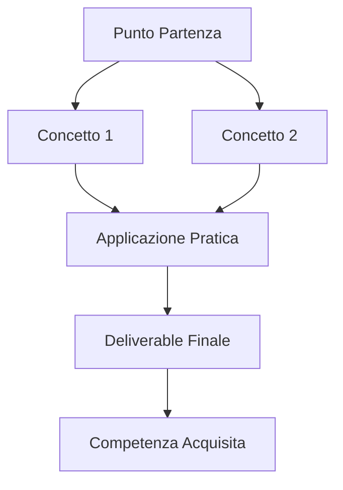

# [TITOLO SEZIONE/GIORNO]

> 📅 **Data**: [Data workshop - se applicabile]
> ⏱️ **Durata totale**: [X ore]
> 🎯 **Livello**: [Base/Intermedio/Avanzato]

---

## 📖 Overview

[Paragrafo introduttivo che spiega cosa copre questa sezione/giorno]

[Paragrafo su perché è importante e cosa imparerai]

---

## 🎯 Learning Objectives

Al termine di questa sezione sarai in grado di:

✅ [Obiettivo macro 1]
✅ [Obiettivo macro 2]
✅ [Obiettivo macro 3]
✅ [Obiettivo macro 4 - opzionale]

---

## 📚 Struttura della Giornata/Sezione

### 🗓️ Timeline

| Orario | Modulo | Durata | Tipo |
|--------|--------|--------|------|
| [HH:MM] | [Nome Modulo 1] | [X min] | 📚 Teoria |
| [HH:MM] | [Nome Modulo 2] | [X min] | 💡 Esempi |
| [HH:MM] | ☕ Pausa | [X min] | - |
| [HH:MM] | [Nome Modulo 3] | [X min] | ✏️ Pratica |
| [HH:MM] | [Nome Modulo 4] | [X min] | 🚀 Challenge |

**Totale**: [X] ore ([Y]% teoria, [Z]% pratica)

---

## 🧩 Moduli

### Modulo 1: [Nome Modulo]

**📍 Cosa imparerai**:
- [Topic 1]
- [Topic 2]
- [Topic 3]

**⏱️ Durata**: [X] min

**🔗 Link**: [Vai al modulo →](./[path-to-module])

---

### Modulo 2: [Nome Modulo]

**📍 Cosa imparerai**:
- [Topic 1]
- [Topic 2]
- [Topic 3]

**⏱️ Durata**: [X] min

**🔗 Link**: [Vai al modulo →](./[path-to-module])

---

### Modulo 3: [Nome Modulo - Esercizi]

**📍 Cosa farai**:
- [Esercizio 1 - descrizione breve]
- [Esercizio 2 - descrizione breve]

**⏱️ Durata**: [X] min

**📦 Deliverable**: [Cosa produrrai]

**🔗 Link**: [Vai agli esercizi →](./[path-to-exercises])

---

[Ripeti per tutti i moduli...]

---

## 🎯 Deliverables Attesi

Al termine di questa sezione avrai creato:

✅ **[Deliverable 1]**: [Descrizione]
- 📄 [Formato/tipo]
- 🎯 [Utilizzo/scopo]

✅ **[Deliverable 2]**: [Descrizione]
- 📄 [Formato/tipo]
- 🎯 [Utilizzo/scopo]

✅ **[Deliverable 3]**: [Descrizione]
- 📄 [Formato/tipo]
- 🎯 [Utilizzo/scopo]

---

## 📋 Prerequisiti

**Conoscenze necessarie**:
- [ ] [Prerequisito 1]
- [ ] [Prerequisito 2]
- [ ] [Prerequisito 3]

**Materiali da preparare**:
- [ ] [Tool/software installato]
- [ ] [Account creato]
- [ ] [File scaricati]

**Moduli da aver completato** (se applicabile):
- [Link modulo prerequisito 1]
- [Link modulo prerequisito 2]

---

## 🚀 Da Dove Partiamo vs Dove Arriviamo

### ❌ Prima (Stato Iniziale)

**Cosa sai/sai fare**:
- [Skill/knowledge level attuale]
- [Limitations/gaps attuali]

**Pain Points**:
- [Problema 1 che hai]
- [Problema 2 che hai]

---

### ✅ Dopo (Stato Finale)

**Cosa saprai/saprai fare**:
- [Nuova skill/knowledge 1]
- [Nuova skill/knowledge 2]
- [Nuova skill/knowledge 3]

**Capacità acquisite**:
- [Capacità 1 - con esempio concreto]
- [Capacità 2 - con esempio concreto]

---

## 💡 Perché Questo è Importante

### Per il Tuo Ruolo

**Per Project Manager**:
[Come i contenuti di questa sezione aiuteranno PM nel lavoro quotidiano]

**Per PMO**:
[Come aiuterà PMO]

**Per Service Designer**:
[Come aiuterà Service Design]

**Per Funzionali/BA**:
[Come aiuterà BA/Funzionali]

---

### ROI Atteso

**Tempo risparmiato**:
- [Task che richiede X ore → diventa Y minuti]

**Qualità migliorata**:
- [Aspetto 1 del lavoro che migliora]
- [Aspetto 2 del lavoro che migliora]

**Nuove capacità**:
- [Cosa potrai fare che prima non potevi]

---

## 🔑 Concetti Chiave

I concetti fondamentali che esplorerai in questa sezione:

### [Concetto 1]
[Breve spiegazione 2-3 righe]

### [Concetto 2]
[Breve spiegazione 2-3 righe]

### [Concetto 3]
[Breve spiegazione 2-3 righe]

[Aggiungi altri concetti chiave...]

---

## 📊 Mappa Concettuale

*[Opzionale - se usi Mermaid plugin, altrimenti rimuovi]*

---

## ✏️ Checklist Progressione

Usa questa checklist per tracciare il tuo avanzamento:

### Modulo 1: [Nome]
- [ ] Completato contenuto teorico
- [ ] Praticato esempi
- [ ] Compreso concetti chiave

### Modulo 2: [Nome]
- [ ] Completato contenuto teorico
- [ ] Praticato esempi
- [ ] Compreso concetti chiave

### Modulo 3: [Nome]
- [ ] Completato esercizio 1
- [ ] Completato esercizio 2
- [ ] Creato deliverable

### Modulo 4: [Nome]
- [ ] [Checkpoint 1]
- [ ] [Checkpoint 2]

**Overall Progress**: ___% completato

---

## 🎓 Metodologia Didattica

Questa sezione segue l'approccio:

**📚 60% Pratica, 40% Teoria**
- Maggior focus su hands-on learning
- Teoria solo ciò che serve per pratica efficace

**🎯 Real-World Focus**
- Tutti esempi contestualizzati a [industry/ruolo]
- Casi d'uso applicabili immediatamente

**🔄 Iterazione & Feedback**
- Pratica → Feedback → Refinement
- Apprendimento by doing

---

## 💬 Q&A Frequenti

<strong>Quanto tempo serve per completare questa sezione?</strong>

[Risposta: tempo stimato, variazioni possibili]

<strong>Devo completare tutto in ordine?</strong>

[Risposta: sì/no e perché]

<strong>Cosa fare se rimango bloccato?</strong>

[Risposta: risorse di supporto, troubleshooting]

<strong>[Altra domanda frequente]</strong>

[Risposta]

---

## 🔗 Risorse per Questa Sezione

**Template & File**:
- 📄 [Template 1 - link]
- 📄 [Template 2 - link]
- 📁 [File esercizi - link download]

**Tool Necessari**:
- 🔧 [Tool 1 - con link setup]
- 🔧 [Tool 2 - con link setup]

**Letture Complementari** (opzionale):
- 📚 [Articolo/docs correlato 1]
- 📚 [Articolo/docs correlato 2]

---

## 🗺️ Navigazione

### 👈 Sezione Precedente
[Link sezione precedente se applicabile]

### 👉 Prossima Sezione
[Link prossima sezione se applicabile]

### 🏠 Torna alla Home
[Link alla home del corso]

---

## 🚀 Inizia Ora!

:::tip Pronto per iniziare?
Procedi con il primo modulo di questa sezione:

**👉 [Vai al Modulo 1: [Nome] →](./[path-to-first-module])**
:::

---

## 📝 Note per il Facilitatore

:::note Solo per Facilitatori

**Preparazione Aula**:
- [ ] [Setup necessario 1]
- [ ] [Setup necessario 2]
- [ ] [Materiali da stampare/preparare]

**Timing Flessibilità**:
- Se gruppo veloce: [Opzioni bonus/avanzate]
- Se gruppo lento: [Cosa skippare/semplificare]

**Punti di Attenzione**:
- [Concetto tipicamente difficile da capire]
- [Dove fare pausa/break]

**Varianti per Audience**:
- Gruppo principalmente PM: [Focus su X, esempi Y]
- Gruppo misto: [Approccio bilanciato]
- Gruppo con background tecnico: [Accelerare su Z]

**Success Metrics**:
- [Come misurare se obiettivi raggiunti]
- [Feedback da raccogliere]

**Troubleshooting**:
- Problema comune 1: [Soluzione]
- Problema comune 2: [Soluzione]

:::

---

## 📊 Feedback & Miglioramento

:::info Il Tuo Feedback è Prezioso
Dopo aver completato questa sezione, aiutaci a migliorare:

**Cosa ha funzionato bene?**
[Form/link feedback]

**Cosa può essere migliorato?**
[Form/link feedback]

**Domande non risolte?**
[Contact/forum]
:::

---

**[Fine Overview]**

🎯 **Next**: Inizia con [Modulo 1 →](./[path-to-module-1])
